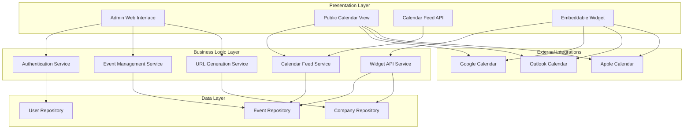

# Design Document

## Overview

The Company Calendar Platform is a web-based application that enables companies to manage their event calendars and share them with external users through standard calendar subscription protocols. The system consists of an authenticated admin interface for calendar management and a public interface for calendar consumption via web view and calendar application subscriptions.

## Architecture

The system follows a three-tier architecture:



## Components and Interfaces

### 1. Authentication Service
- **Purpose**: Handles company administrator login and session management
- **Key Methods**:
  - `authenticate(username, password): AuthResult`
  - `validateSession(sessionToken): boolean`
  - `logout(sessionToken): void`
- **Dependencies**: User Repository

### 2. Event Management Service
- **Purpose**: Manages CRUD operations for calendar events
- **Key Methods**:
  - `createEvent(companyId, eventData): Event`
  - `updateEvent(eventId, eventData): Event`
  - `deleteEvent(eventId): boolean`
  - `getCompanyEvents(companyId): Event[]`
- **Dependencies**: Event Repository

### 3. Calendar Feed Service
- **Purpose**: Generates calendar feeds in standard formats (iCal/ICS)
- **Key Methods**:
  - `generateICalFeed(companyId): string`
  - `getPublicEvents(companyId): Event[]`
  - `formatEventForFeed(event): ICalEvent`
- **Dependencies**: Event Repository

### 4. URL Generation Service
- **Purpose**: Creates and manages shareable calendar URLs
- **Key Methods**:
  - `generateShareableUrl(companyId): string`
  - `getCompanyByShareUrl(shareUrl): Company`
  - `generateCalendarSubscriptionUrls(shareUrl): CalendarUrls`
  - `generateEmbedCode(companyId): string`
- **Dependencies**: Company Repository

### 5. Widget API Service
- **Purpose**: Provides API endpoints for embeddable widget functionality
- **Key Methods**:
  - `getWidgetEvents(companyId): Event[]`
  - `getWidgetConfig(companyId): WidgetConfig`
  - `generateWidgetScript(companyId): string`
- **Dependencies**: Event Repository, Company Repository

### 6. Admin Web Interface
- **Purpose**: Provides authenticated interface for calendar management
- **Key Components**:
  - Login form with validation
  - Calendar dashboard with event CRUD operations
  - Shareable URL display and management
  - Embeddable widget code generator with customization options
  - Event form with date/time pickers

### 7. Public Calendar View
- **Purpose**: Displays calendar events to external users
- **Key Components**:
  - Public calendar grid view
  - "Add to Calendar" integration buttons
  - iCal/ICS feed endpoints
  - Responsive design for mobile access

### 8. Embeddable Widget
- **Purpose**: Provides JavaScript widget for embedding calendar on company websites
- **Key Components**:
  - Lightweight JavaScript library for calendar display
  - Modal popup with event details and calendar integration buttons
  - Customizable styling options (theme, colors, layout)
  - Responsive widget that adapts to parent container
  - Event filtering options (upcoming only, max events)
  - Click-to-expand functionality with detailed event information

## Data Models

### User
```typescript
interface User {
  id: string;
  username: string;
  passwordHash: string;
  companyId: string;
  createdAt: Date;
  lastLoginAt: Date;
}
```

### Company
```typescript
interface Company {
  id: string;
  name: string;
  shareableUrl: string;
  createdAt: Date;
  updatedAt: Date;
}
```

### Event
```typescript
interface Event {
  id: string;
  companyId: string;
  title: string;
  description: string;
  startDateTime: Date;
  endDateTime: Date;
  location?: string;
  isPublic: boolean;
  createdAt: Date;
  updatedAt: Date;
}
```

### Calendar Integration URLs
```typescript
interface CalendarUrls {
  icalFeed: string;
  googleCalendar: string;
  outlookCalendar: string;
  appleCalendar: string;
}
```

### Widget Configuration
```typescript
interface WidgetConfig {
  companyId: string;
  theme: 'light' | 'dark' | 'auto';
  primaryColor: string;
  showUpcomingOnly: boolean;
  maxEvents: number;
  dateFormat: string;
}
```

## Error Handling

### Authentication Errors
- Invalid credentials: Return 401 with user-friendly message
- Session expired: Redirect to login with session timeout message
- Unauthorized access: Return 403 with access denied message

### Event Management Errors
- Validation errors: Return 400 with field-specific error messages
- Event not found: Return 404 with appropriate message
- Database errors: Return 500 with generic error message, log detailed error

### Calendar Feed Errors
- Invalid company ID: Return 404 with calendar not found message
- Feed generation errors: Return 500 with service unavailable message
- Malformed date/time data: Log error and exclude problematic events from feed

### Public Calendar Errors
- Invalid share URL: Return 404 with calendar not found page
- Calendar service unavailable: Display maintenance message with retry option

## Testing Strategy

### Unit Testing
- **Authentication Service**: Test login validation, session management, and security
- **Event Management Service**: Test CRUD operations, validation, and business logic
- **Calendar Feed Service**: Test iCal generation, date formatting, and feed structure
- **URL Generation Service**: Test URL uniqueness, validation, and mapping

### Integration Testing
- **Database Operations**: Test repository layer with real database connections
- **Calendar Feed Generation**: Test end-to-end feed creation and validation
- **External Calendar Integration**: Test "Add to Calendar" URL generation and functionality

### End-to-End Testing
- **Admin Workflow**: Test complete login → create event → share calendar flow
- **Public Access**: Test calendar subscription and viewing from external user perspective
- **Calendar App Integration**: Test subscription URLs in actual calendar applications

### Security Testing
- **Authentication**: Test password security, session management, and unauthorized access
- **Input Validation**: Test SQL injection, XSS, and malformed data handling
- **Public Access**: Ensure no sensitive data exposure in public feeds

## Performance Considerations

### Caching Strategy
- Cache generated iCal feeds for 15 minutes to reduce database load
- Cache public calendar views for 5 minutes
- Implement cache invalidation on event updates

### Database Optimization
- Index company_id and date fields for efficient event queries
- Implement pagination for large event lists
- Use database-level date filtering for performance

### Scalability
- Design stateless services for horizontal scaling
- Use CDN for static assets and public calendar views
- Implement rate limiting for public feed endpoints