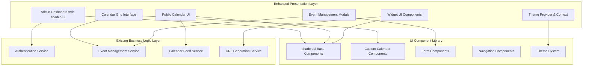

# Design Document

## Overview

This design focuses on implementing a comprehensive UI/UX overhaul of the company calendar platform using shadcn/ui as the foundation design system. The implementation will introduce a modern calendar-style interface for event management, consistent theming, and improved user experience while maintaining all existing functionality.

## Architecture

The design system will be integrated into the existing three-tier architecture:



## Components and Interfaces

### 1. Design System Foundation

#### shadcn/ui Integration
- **Base Components**: Button, Input, Card, Dialog, Form, Select, Calendar, Popover
- **Layout Components**: Navigation sidebar, header, main content areas
- **Feedback Components**: Toast notifications, loading states, error boundaries
- **Theme System**: CSS variables for colors, typography, spacing, and shadows

#### Custom Component Extensions
- **CalendarGrid**: Extended calendar component with event display and interaction
- **EventCard**: Reusable event display component for different contexts
- **EventForm**: Comprehensive form component for event creation/editing
- **ThemeCustomizer**: Interface for brand color and theme customization

### 2. Calendar Interface Components

#### CalendarGrid Component
```typescript
interface CalendarGridProps {
  view: 'month' | 'week' | 'day';
  selectedDate: Date;
  events: Event[];
  onDateSelect: (date: Date) => void;
  onEventClick: (event: Event) => void;
  onEventDrop: (eventId: string, newDate: Date) => void;
  onCreateEvent: (date: Date) => void;
}
```

#### Event Display System
- **Event Tiles**: Compact event representation on calendar grid
- **Event Details Modal**: Full event information with edit capabilities
- **Drag & Drop**: Visual feedback for event rescheduling
- **Time Slot Management**: Visual time blocks for day/week views

### 3. Form and Input Components

#### Enhanced Event Form
```typescript
interface EventFormProps {
  event?: Event;
  initialDate?: Date;
  onSave: (eventData: EventData) => Promise<void>;
  onCancel: () => void;
  isOpen: boolean;
}
```

#### Form Features
- **Date/Time Pickers**: shadcn Calendar and custom time selection
- **Rich Text Editor**: For event descriptions with formatting
- **Validation**: Real-time field validation with error states
- **Auto-save**: Draft saving for long form sessions

### 4. Navigation and Layout

#### Sidebar Navigation
```typescript
interface NavigationItem {
  label: string;
  icon: React.ComponentType;
  href: string;
  badge?: number;
  children?: NavigationItem[];
}
```

#### Layout System
- **Responsive Grid**: CSS Grid-based layout system
- **Sidebar**: Collapsible navigation with icons and labels
- **Header**: Breadcrumbs, user menu, theme toggle
- **Main Content**: Consistent padding and spacing

### 5. Theme System

#### Theme Configuration
```typescript
interface ThemeConfig {
  mode: 'light' | 'dark' | 'system';
  primaryColor: string;
  secondaryColor: string;
  borderRadius: 'none' | 'sm' | 'md' | 'lg';
  fontFamily: 'default' | 'mono' | 'sans';
}
```

#### CSS Variables Structure
```css
:root {
  --background: 0 0% 100%;
  --foreground: 222.2 84% 4.9%;
  --primary: 222.2 47.4% 11.2%;
  --primary-foreground: 210 40% 98%;
  --secondary: 210 40% 96%;
  --secondary-foreground: 222.2 84% 4.9%;
  --muted: 210 40% 96%;
  --muted-foreground: 215.4 16.3% 46.9%;
  --accent: 210 40% 96%;
  --accent-foreground: 222.2 84% 4.9%;
  --destructive: 0 84.2% 60.2%;
  --destructive-foreground: 210 40% 98%;
  --border: 214.3 31.8% 91.4%;
  --input: 214.3 31.8% 91.4%;
  --ring: 222.2 84% 4.9%;
  --radius: 0.5rem;
}
```

## Data Models

### UI State Management
```typescript
interface UIState {
  theme: ThemeConfig;
  calendarView: 'month' | 'week' | 'day';
  selectedDate: Date;
  sidebarCollapsed: boolean;
  activeModal: string | null;
}

interface CalendarViewState {
  currentDate: Date;
  selectedEvents: string[];
  draggedEvent: Event | null;
  isCreatingEvent: boolean;
  newEventDate: Date | null;
}
```

### Component Props Interfaces
```typescript
interface EventTileProps {
  event: Event;
  onClick: () => void;
  onEdit: () => void;
  onDelete: () => void;
  compact?: boolean;
}

interface DatePickerProps {
  value: Date;
  onChange: (date: Date) => void;
  minDate?: Date;
  maxDate?: Date;
  disabled?: boolean;
}
```

## User Experience Flow

### Admin Event Management Flow
1. **Dashboard Landing**: Overview with recent events and quick actions
2. **Calendar Navigation**: Switch between month/week/day views
3. **Event Creation**: Click date → modal opens → form completion → save
4. **Event Editing**: Click event → details modal → edit mode → save changes
5. **Event Rescheduling**: Drag event to new date → confirmation → update

### Theme Customization Flow
1. **Theme Settings**: Access via user menu or settings page
2. **Mode Selection**: Toggle between light/dark/system preference
3. **Color Customization**: Select primary/secondary colors with preview
4. **Apply Changes**: Real-time preview with save confirmation

## Responsive Design Strategy

### Breakpoint System
- **Mobile**: < 768px - Single column, touch-optimized
- **Tablet**: 768px - 1024px - Adaptive sidebar, optimized spacing
- **Desktop**: > 1024px - Full sidebar, multi-column layouts

### Mobile Optimizations
- **Touch Targets**: Minimum 44px touch areas
- **Gesture Support**: Swipe navigation for calendar views
- **Compact Views**: Condensed event display for small screens
- **Bottom Navigation**: Alternative navigation for mobile devices

## Accessibility Implementation

### WCAG 2.1 AA Compliance
- **Keyboard Navigation**: Full keyboard accessibility for all interactions
- **Screen Reader Support**: Proper ARIA labels and semantic HTML
- **Color Contrast**: Minimum 4.5:1 contrast ratio for all text
- **Focus Management**: Clear focus indicators and logical tab order

### Accessibility Features
- **High Contrast Mode**: Enhanced contrast theme option
- **Reduced Motion**: Respect user's motion preferences
- **Font Scaling**: Support for browser font size adjustments
- **Alternative Text**: Descriptive alt text for all images and icons

## Performance Considerations

### Component Optimization
- **Lazy Loading**: Code splitting for calendar components
- **Virtualization**: Virtual scrolling for large event lists
- **Memoization**: React.memo for expensive calendar calculations
- **Bundle Size**: Tree-shaking for unused shadcn components

### Rendering Strategy
- **Server-Side Rendering**: Initial page load optimization
- **Progressive Enhancement**: Core functionality without JavaScript
- **Caching**: Component-level caching for static elements
- **Image Optimization**: Responsive images with proper sizing

## Implementation Phases

### Phase 1: Foundation Setup
- Install and configure shadcn/ui
- Set up theme system and CSS variables
- Create base layout components
- Implement navigation structure

### Phase 2: Calendar Interface
- Build calendar grid component
- Implement event display system
- Add drag & drop functionality
- Create event creation/editing modals

### Phase 3: Enhanced Forms
- Upgrade all forms to shadcn components
- Implement advanced date/time pickers
- Add form validation and error handling
- Create reusable form patterns

### Phase 4: Theme Customization
- Build theme customization interface
- Implement color picker components
- Add theme persistence
- Create theme preview system

### Phase 5: Public Interface
- Apply design system to public calendar
- Optimize mobile experience
- Enhance widget styling
- Improve accessibility features

## Testing Strategy

### Component Testing
- **Unit Tests**: Individual component functionality
- **Visual Regression**: Screenshot comparison testing
- **Accessibility Tests**: Automated a11y testing
- **Interaction Tests**: User interaction simulation

### Integration Testing
- **Theme Switching**: Test theme changes across components
- **Calendar Interactions**: Test event creation/editing flows
- **Responsive Behavior**: Test across different screen sizes
- **Cross-browser Compatibility**: Test in major browsers

### User Experience Testing
- **Usability Testing**: Task completion and user satisfaction
- **Performance Testing**: Load times and interaction responsiveness
- **Accessibility Testing**: Screen reader and keyboard navigation
- **Mobile Testing**: Touch interactions and gesture support